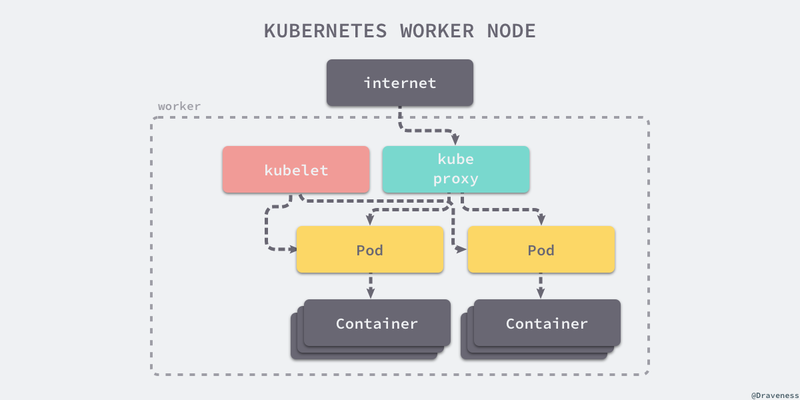
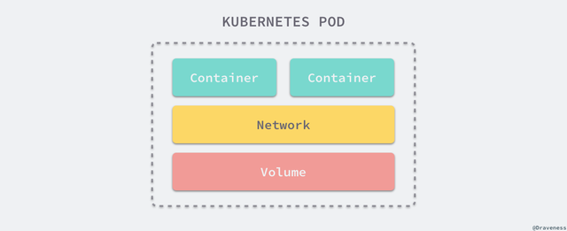
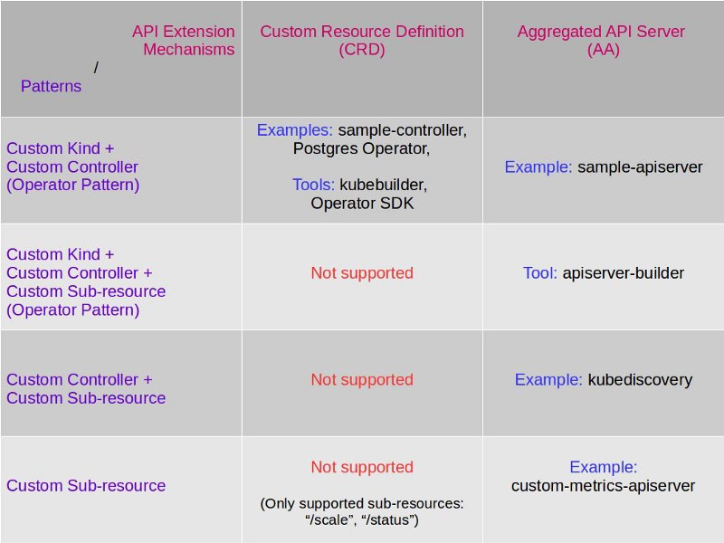

title: Intro to Kubernetes
author:
  name: Xin Gao
output: k8s-intro.html
theme: jdan/cleaver-retro

------------------------------------------------------------------------------

# Introduction to Kubernetes
## [Xin Gao]()

------------------------------------------------------------------------------

### Contents

* Overview & Architecture 
* Concepts
* Installation & Bootcamp
* Netwoking 
* Storage
* Monitoring & Logging
* Extensions 
* Operator & Helm
* Ecosystem

------------------------------------------------------------------------------

### What is Kubernetes

* Container orchestration and management system
* Successor of Google Borg/Omega system
* Written by and heavily depends on Golang

#### <center></center>
<div style="font-size: 15px; float: right">
    Image above is taken from https://github.com/ashleymcnamara/gophers
</div>

------------------------------------------------------------------------------

### Core Features

#### <center></center>
<div style="font-size: 15px; float: right">
    Image above is taken from http://blog.itpub.net/31555606/viewspace-2215609/
</div>

------------------------------------------------------------------------------

### Architecture

</br>
#### <center></center>
<div style="font-size: 15px; float: right">
    Image above is taken from https://draveness.me/understanding-kubernetes
</div>

------------------------------------------------------------------------------

### Master

#### <center></center>
<div style="font-size: 15px; float: right">
    Image above is taken from https://draveness.me/understanding-kubernetes
</div>

------------------------------------------------------------------------------

### Worker

#### <center></center>
<div style="font-size: 15px; float: right">
    Image above is taken from https://draveness.me/understanding-kubernetes
</div>

------------------------------------------------------------------------------

### Basic Objects

* Node
* Pod
* Service
* Volume
* Namespace

------------------------------------------------------------------------------

### Controllers

* ReplicaSet - Control Pod (Number of copies)
* Deployment - Control Replicaset (Versions)
* StatefulSet - Control Pod (Same container image for all nodes)
* DaemonSet - Pod run in all nodes and one per node, auto add/delete for node
* Job 
* CronJob
* ...

------------------------------------------------------------------------------

### Other Concepts

* ThirdPartyResources
* CustomResourceDefinition (CRD)
* Autoscaling (HPA)
* ConfigMap
* LocalVolume
* PersistentVolume
* PersistentVolumeClaim
* Secret
* ...

------------------------------------------------------------------------------

### Installation

* Kubernetes playgrounds
    * [Play with Kubernetes](https://training.play-with-kubernetes.com/kubernetes-workshop/)
    * [Katacoda](https://www.katacoda.com/courses/kubernetes/playground)
* Minikube
* kubeadm
* Kubespray

------------------------------------------------------------------------------

### ABC

#### <center>[kubernetes-bootcamp](https://kubernetesbootcamp.github.io/kubernetes-bootcamp/)</center>

* Create a Kubernetes cluster 
* Deploy an app 
* Explore your app 
* Expose your app publicly
* Running multiple instances of an app 
* Performing a rolling update for an app

------------------------------------------------------------------------------

### Pod

* A Pod is the basic building block of Kubernetes. 
  – the smallest and simplest unit in the Kubernetes object model 
  that you create or deploy.

<center></center>
<div style="font-size: 15px; float: right">
    Image above is taken from https://draveness.me/kubernetes-pod
</div>

------------------------------------------------------------------------------

### Namespace

* It's intended for use in environments with many users spread across multiple 
  teams, or projects
* A way to divide cluster resources between multiple users

------------------------------------------------------------------------------

### Service 

* An abstraction which defines a logical set of Pods, 
  and policy by which to access them
* The set of Pods targeted by Service is(usually) determined by Label Selector
* Use Kube-proxy component: iptables/IPVS    
* ClusterIP(VIP), NodePort, Loadbalancer, ExternalName

------------------------------------------------------------------------------

### DNS 

* Use CoreDNS
* Watches the Kubernetes API for new Services 
* Creates a set of DNS records.
    * Services DNS record: 
        my-svc.my-namespace.svc.cluster.local
    * Pods DNS record:
        pod-ip-address.my-namespace.pod.cluster.local

------------------------------------------------------------------------------

### Ingress

* Services are a “layer 4” (TCP/UDP over IP) construct.
* Represents “layer 7”(HTTP) services
* Exposes HTTP and HTTPS routes from outside cluster to services within cluster
* Use Ingress Controller: watching Service and Ingress  

                        internet
                            |
                       [ Ingress ]
                       --|-----|--
                       [ Services ]

------------------------------------------------------------------------------

### NetworkPolicy

* By default, pods are non-isolated; they accept traffic from any source.
* A network policy is a specification of how groups of pods are allowed to 
  communicate with each other and other network endpoints
* NetworkPolicy resources use labels to select pods and define rules 
  which specify what traffic is allowed to the selected pods.
* Need NetworkPolicy controller

------------------------------------------------------------------------------

### Netwok Modal

* IP-per-Pod: IP in flat shared networking namespace
* Pod-to-Service: Internal cluster, use Service ClusterIP   
* External-to-Internal: NodePort, LoadBalancer, Ingress
* Use CNI(Container Network Interface) to call plugins or Kubenet plugin  
* Node-to-Node
  * Routing: Linux Bridge with gateway + routing rules   
  * Overlay: Linux Bridge with gateway + VXLAN

------------------------------------------------------------------------------

### Kubenet plugin 

* Besed on CNI Bridge plugin, only support Docker runtime

------------------------------------------------------------------------------

### CNI

* CNI: In sandbox container, create Network namespace and then waiting for 
  the plugins to implemente network

------------------------------------------------------------------------------

### CNI Plugins

#### Flannel 
* Based on CNI Bridge to extend: add routing rules to flannel.1(VXLan Device)  
* Build connection by vxlan and forward to vxlan by routing rules
* VXLAN, host-gw(use etcd), UDP

------------------------------------------------------------------------------

### CNI Plugins

#### Calico    
* layer 3 virtual network, with vRouter(BGP for broadcast routing rules)
* Support network policy
* Diff with Flannel: do not use bridge, create veth pair for pods

------------------------------------------------------------------------------

### CNI Plugins

#### Weave
* support network policy, and encryption transmission  
* Use weave bridge and create veth pair and connect to openvswitch

------------------------------------------------------------------------------

### Volume 

* Just a directory, possibly with some data in it, 
  which is accessible to the Containers in a Pod
* Has an explicit lifetime - the same as the Pod that encloses it
    * EmptyDir
    * HostPath
    * NFS 
    * Ceph: RBD, CephFS 
    * Glusterfs
    * Iscsi 
    * ...

------------------------------------------------------------------------------

### FlexVolume 

* Out-of-tree plugin interface
* It uses an exec-based model to interface with drivers
* FlexVolume driver binaries must be installed 
  in a pre-defined volume plugin path on each node 
* Kubernetes Flex Volume was an early attempt at pluggability, 
* It was difficult to deploy

------------------------------------------------------------------------------

### PersistentVolume (PV)

* Represent the backend storage entity that a pod might consume
* Details of the implementation of the storage, 
  be that NFS, iSCSI, or a cloud-provider-specific storage system

------------------------------------------------------------------------------

### PersistentVolumeClaim (PVC)

* Represents the exclusive usage of a Persistent Volume by a particular Pod
* Can request specific size and access modes

------------------------------------------------------------------------------

### StorageClass

* A StorageClass provides a way for administrators to describe the “classes” of 
  storage they offer.

------------------------------------------------------------------------------

### PV + PVC + StorageClass

* Provisioning: Static, Dynamic (StorageClass)
* Binding 
* Using 
* Reclaiming: Retained, Recycled, Deleted

* Think PV is a storage pool
* PVC is a volume which would be carved out from the storage pool
* One PV maps to one PVC, and vice versa

------------------------------------------------------------------------------

### CSI

* Container Storage Interface (CSI) defines a standard interface 
  for container orchestration systems (like Kubernetes) to 
  expose arbitrary storage systems to their container workloads.
* External Components: Driver Register, External Provisioner, External Attacher
* Diff between Flexvolume and CSI:
    * Install and deployment
    * Communication between Plugin and Driver 
    * Flexvolume only do Attach and Mount, no Provision

------------------------------------------------------------------------------

### Many ways of persisting data

Take AWS EBS for example,  
* Volume Way: awsElasticBlockStore (is a Volume type)
* PV way: AWSElasticBlockStore (is also a PV type)
* Provisioner way: kubernetes.io/aws-ebs (Kubernetes built-in Provisioner for EBS)
* Third-Party Way: third-party implementations of EBS, and CSI driver
* VolumeClaimTemplate Way: StatefulSet spec
* Choose Provisioner over Persistent Volume, Persistent Volume over Volume when possible.

------------------------------------------------------------------------------

### Monitoring & Metrics

* Metrics Server + CAdvisor + Prometheus + InfluxDB + Grafana

------------------------------------------------------------------------------

### Logging 

* EFK: Fluentd(Deployment) + ElasticSearch(StatefulSet) + kibana  
* Put agent(Fluentd, Daemonset) to Node, and then forward logging to backend storage
* When logging on some files, re output logging files to sidecar container's stdout and stderr
* Through sidecar container, send logging files to remote logging server

------------------------------------------------------------------------------

### Declarative VS Imperative

      kubectl run nginx --image nginx    
      kubectl create deployment nginx --image nginx

      kubectl create -f nginx.yaml
      kubectl delete -f nginx.yaml -f redis.yaml
      kubectl replace -f nginx.yaml
<hr>

      kubectl diff -R -f configs/
      kubectl apply -R -f configs/

------------------------------------------------------------------------------

### Controller Pattern

The heart of Kubernetes orchestrator

```go
    // Control loop
    for {
        current := getCurrentState()
        desired := getDesiredState()
    if current == designed {
        // Do nothing
    } else 
        // Reconcile
        makeChanges(desired, current)
    }
```
------------------------------------------------------------------------------

### Extensions

Modularity, Extensibility, Pluggability

* Clients: kubectl -> kubectl plugin 
* API types: Pod, deployment, etc -> CRDs
* API controllers: kube-apiserver -> Custom Controller(Operator)
* Access controllers: Authc, Authz, admission controller -> Webhook and initializers
* Scheduling: kube-scheduler -> Custom scheduler
* Infra: Runtime, Network, Storage -> CRI, CNI, CSI 
* Resource metrics: CPU, memory -> Custom metrics: pod metrics, object metrics

------------------------------------------------------------------------------

### API Aggregation(AA)

Extend with additional APIs, beyond what is offered by the core Kubernetes APIs.

* Create RBAC rule 
* Create namespace
* Create CA certification
* Create secret 
* Create a deployment 
* Create ClusterRole and ClusterRoleBinding
* Create Non namespace apiserver

Use apiserver-builder to automate the process above

------------------------------------------------------------------------------

### CustomResourceDefinitions(CRDs)

* A resource is an endpoint in the Kubernetes API that stores 
  a collection of API objects of a certain kind.
* A custom resource is an extension of the Kubernetes API
* Can be used to create Custom Controller

------------------------------------------------------------------------------

### AA vs CRD 

Extended API: (a) Custom Kind (b) Custom controller (c) Custom sub-resource

#### <center></center>
<div style="font-size: 15px; float: right">
    Image above is taken https://itnext.io/comparing-kubernetes-api-extension
-mechanisms-of-custom-resource-definition-and-aggregated-api-64f4ca6d0966
</div>

------------------------------------------------------------------------------

### Operator

Operator=CRD+Controller

A resolution for the management of stateful app

* StatefulSet 
* TPR (Third Party Resource)-> Operator 
* TPR -> UAS (User Aggregated APIServer)
* TPR -> CRD (Custom Resource Definition)
* Operator Framework

------------------------------------------------------------------------------

### Helm

* Tool for packaging multiple Kubernetes resources into a single package
* Tool for creating a Kubernetes Operator from a Helm Chart 
* Prometheus Operator: all components were wrapped as Helm Chart

------------------------------------------------------------------------------

### Ecosystem

* With VMs: 
  [Stackube](https://github.com/openstack/stackube), 
  [KubeVirt](https://github.com/kubevirt/kubevirt), 
  [Virtlet](https://github.com/Mirantis/virtlet)
* PAAS: 
  [Openshift](https://www.openshift.com/), 
  [Rancher](https://rancher.com/)
* Serverless: 
  [Knative](https://cloud.google.com/knative/)
* Service mesh: 
  [Istio](https://istio.io/)
* Machine learning: 
  [Kubeflow](https://github.com/kubeflow/kubeflow)

------------------------------------------------------------------------------

### Summary

* Containers Orchestration
* Autoscaling
* Declarative
* Reconciliation by Controllers 
* Modularity, Extensibility, Pluggability

“Kubernetes is the Linux of the cloud.”    
         - Jim Zemlin, Linux Foundation

------------------------------------------------------------------------------

### External links

* [Kubernetes documentation](https://kubernetes.io/docs)
